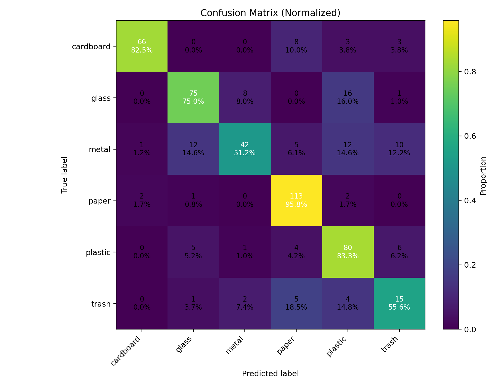

# 🛍️ Plastic Detector: AI for Waste Sorting

## 🔑 Project Overview
This project uses **Deep Learning (EfficientNetB0)** to classify and detect **plastic waste vs. other waste categories**.  
It can work as a **multi-class waste classifier** (plastic, glass, cardboard, metal, paper, trash) and also as a **binary plastic/not-plastic detector** for folder scans.

### Why?
- Automates waste sorting in recycling plants.
- Helps smart bins identify recyclables.
- Supports sustainability & AI-driven waste management.

---

## 📂 Dataset
The dataset is organized into subfolders (Resized TrashNet style):

archive/
└── dataset-resized/
├── cardboard/
├── glass/
├── metal/
├── paper/
├── plastic/
└── trash/

yaml
Copy code

Each subfolder contains training images for that category.

---

## ⚙️ Setup

### 1. Clone / Download
Clone your repo or copy the project to your machine.

### 2. Install Requirements
```bash
pip install tensorflow==2.15.0 tensorflow-io-gcs-filesystem==0.34.0
pip install numpy pandas scikit-learn pillow pyyaml tqdm matplotlib
3. Verify Dataset
Place your dataset under:

makefile
Copy code
C:\Users\sagni\Downloads\Plastic Detector\archive\dataset-resized\
🚀 Training
Run the training script:

bash
Copy code
python train_plastic_detector.py
This will:

Train an EfficientNetB0 classifier on your dataset.

Save artifacts in C:\Users\sagni\Downloads\Plastic Detector\:

model.h5 – trained Keras model

class_indices.pkl – class → index mapping

metrics.json – accuracy/loss history

val_predictions.json – validation predictions

run_config.yaml – run details

Accuracy/loss plots (accuracy_loss.png)

Confusion matrix heatmap (confusion_matrix.png)

Reports (classification_report.csv, confusion_matrix.csv)

🔮 Prediction (Single Image / Folder)
Jupyter Notebook usage
Load the helper module:

python
Copy code
from predict_plastic import predict_image, predict_folder
Predict one image:

python
Copy code
predict_image(r"C:\Users\sagni\Downloads\Plastic Detector\archive\dataset-resized\plastic\example.jpg", topk=3, annotate=True)
Predict a whole folder:

python
Copy code
predict_folder(r"C:\Users\sagni\Downloads\Plastic Detector\archive\dataset-resized\glass", annotate=True)
Outputs:

predictions.json / predictions.csv

Annotated images in annotated/

♻️ Binary Plastic vs Not-Plastic Detector
To classify all images in a folder as plastic or not_plastic:

python
Copy code
detect_plastic_folder(r"C:\Users\sagni\Downloads\Plastic Detector\Demo")
What happens:
Each image is scored for plastic probability.

If prob ≥ 0.5 → plastic else not_plastic.

Saves outputs to C:\Users\sagni\Downloads\Plastic Detector\:

plastic_folder_predictions.csv – file, prob, label

plastic_folder_predictions.json – same in JSON

plastic_folder_summary.json – summary counts & mean prob

Annotated images in annotated_binary/

Example result (summary)
json
Copy code
{
  "folder": "C:\\Users\\sagni\\Downloads\\Plastic Detector\\Demo",
  "total_images": 50,
  "threshold": 0.5,
  "counts": {
    "plastic": 32,
    "not_plastic": 18
  },
  "mean_plastic_prob": 0.64
}
📊 Visualizations
Accuracy vs. Loss curves (saved as accuracy_loss.png)

Confusion Matrix heatmap (saved as confusion_matrix.png)

Prediction distribution bar chart (shown inline in Jupyter)

🛠️ Tech Stack
Deep Learning: TensorFlow / Keras (EfficientNetB0)

Image Processing: Pillow, OpenCV (optional)

Metrics & Visualization: Matplotlib, scikit-learn

Backend Ready: FastAPI / Flask can serve the model

Dashboard Ready: Streamlit frontend for demo UI

📌 Next Steps
Extend to object detection (YOLOv8) for detecting multiple items per photo.

Deploy with Streamlit or FastAPI for live demo.

Optimize for edge devices (convert to TFLite / ONNX).

✨ Author
Sagnik Patra
M.Tech CSE @ IIIT • ML Researcher • GitHub: sagnik1-patra
